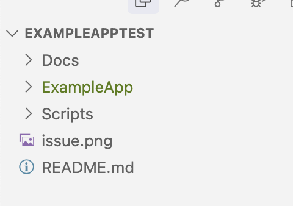
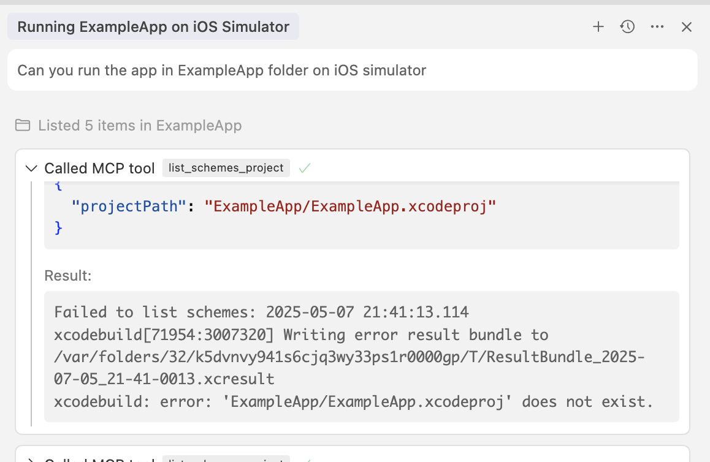

# Readme

This is a sample project to reproduce the issue that [XcodeBuild MCP](https://github.com/cameroncooke/XcodeBuildMCP) can't build a project in a subfolder.

# Step to reproduce

Just import the ExampleAppTest into Cursor



then ask XcodeBuild MCP to build the app

```
Can you run the app in ExampleApp folder on iOS simulator
```

We should se the following issue in Cursor chat



# Solution

Use the following prompt

```
can you build and run my ios app
```

or 

```
can you run and build the target ExampleApp2 in my iOS app
```